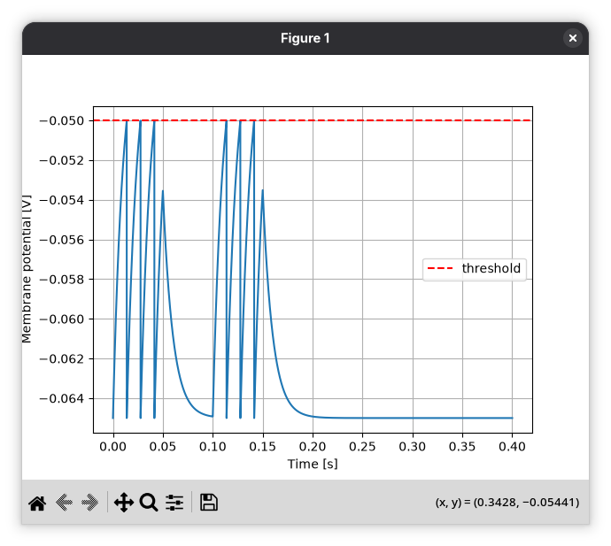

# neuron

A leaky integrate-and-fire (LIF) neuron simulation. The membrane potential is driven by a pulsed input current, integrated with Euler's method, and reset to rest when it crosses threshold.



## Requirements

- Python 3.14
- [uv](https://docs.astral.sh/uv/)

A devcontainer with both is provided in `.devcontainer/`.

## Usage

```bash
uv sync
uv run neuron lif
```

## Parameters

Parameters live in `LIFParams` in `src/neuron/params.py`. Edit the defaults there, or pass your own:

```python
from neuron.models.lif import run
from neuron.params import LIFParams

run(LIFParams(I=3e-9, n_pulses=3))
```

## License

GPL-3.0. See [LICENSE](LICENSE).
